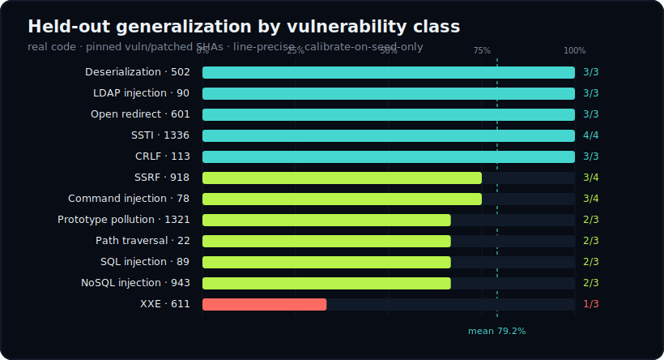
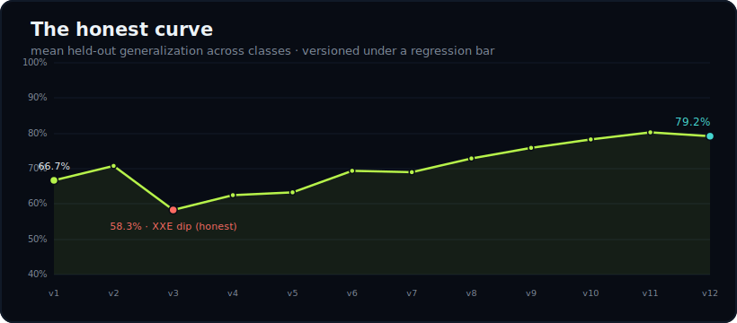
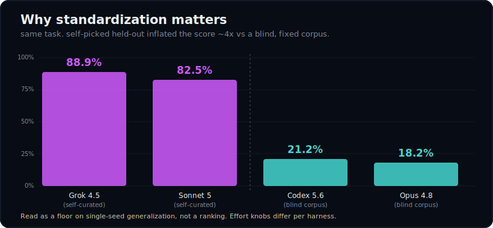

<div align="center">


<h1>DeepThought</h1>

### The answer is probably a vulnerability.

**Autonomous security research for a mostly insecure galaxy.**

DeepThought is a governed harness for autonomous vulnerability research. It maps unfamiliar software, develops hypotheses, follows improbable leads, coordinates specialized workers, preserves durable research memory, and prepares evidence-backed findings for human review.

**Don’t panic. Verify.**

[](LICENSE)
[](https://www.python.org/)
[](#status)
[](#safety-model)

**[Read the field guide →](https://mahdihedhli.github.io/DeepThought/)**

</div>

---

## What is DeepThought?

Give DeepThought an authorized target, a defined scope, and a research objective. It will investigate the software autonomously until it reaches one of three things:

1. evidence,
2. a safety gate,
3. or the limits of its budget.

It is designed to operate independently without becoming recklessly independent, which is an important distinction in both security research and intergalactic travel.

DeepThought can:

- map attack surfaces and trust boundaries
- generate and prioritize vulnerability hypotheses
- coordinate bounded specialist workers
- ingest SARIF and maintain a strict finding lifecycle
- investigate sibling and variant vulnerabilities
- verify candidates in controlled environments
- preserve research knowledge across sessions and AI harnesses
- prepare advisory, CVE, CSAF, OpenVEX, and OSV artifacts
- stop when authorization, scope, evidence, or budget runs out

DeepThought cannot:

- authorize itself
- silently expand its own scope
- execute untrusted target code without explicit human approval
- transmit a disclosure
- declare a finding verified without evidence
- explain why developers keep deserializing untrusted input

> **Many hypotheses enter. Only evidence survives.**

## Why DeepThought exists

Most autonomous security tools are optimized to produce more alerts. DeepThought is designed to produce better research.

The platform separates candidates from verified findings, keeps execution and disclosure behind hard human stops, records negative results, and preserves the reasoning that made each investigation useful. A missed hypothesis remains a lesson. A failed detector remains a regression fixture. A worker result remains data, not authority.

The objective is not maximum activity. It is defensible discovery.

## Current capabilities

| Feature | Session or capability | Risk posture |
|---|---|---|
| **001** | `NEW PROJECT`, `STATUS` | Read-only platform spine |
| **002** | `MAP`, `DISCOVER` | Static reasoning to candidate findings |
| **003** | `VERIFY` | Sandboxed reproduction behind a hard stop |
| **004** | `SIBLING HUNT` | Read-only cross-project variant analysis |
| **005** | `DISCLOSURE` | Draft-only advisory, CVE, CSAF, and OpenVEX |
| **006** | `loop` | Bounded autonomous driver that escalates hard stops |

No untrusted target code executes without explicit human sign-off. No disclosure leaves the machine. The autonomous loop can chain safe, read-only, and draft-only work under a fixed budget, but it cannot expand scope, authorize execution, or send a disclosure.

## The Guide, in three verbs

```bash
deepthought playbook   # run a typed research session
deepthought check      # validate state, schemas, lifecycle, and conformance
deepthought publish    # emit prepared local artifacts; transmit nothing
```

Available playbooks:

```bash
deepthought playbook new-project ...
deepthought playbook status --project <id>
deepthought playbook map --project <id>
deepthought playbook discover --project <id> [--sarif <path>]
deepthought playbook verify --project <id> --finding <F-NNNN>
deepthought playbook sibling-hunt --project <id> --finding <F-NNNN> [--sibling <id> ...]
deepthought playbook disclose --project <id> --finding <F-NNNN>
```

The bounded autonomous driver:

```bash
deepthought loop \
  --project <id> \
  --max-sessions N \
  [--max-seconds S] \
  [--max-tokens T]
```

The loop advances safe work until it reaches a fixed point, exhausts its budget, or encounters a gate. `NEW PROJECT`, real target execution, scope expansion, and disclosure transmission remain human decisions.

## Quickstart

Requirements:

- Python 3.12+
- [`uv`](https://docs.astral.sh/uv/)
- an authorized research target
- a healthy skepticism of apparently harmless input

```bash
git clone https://github.com/MahdiHedhli/DeepThought.git
cd DeepThought

uv venv --python 3.12 .venv
uv pip install --python .venv -e ".[dev]"
```

Register a project, inspect it, validate the store, and prepare local artifacts:

```bash
.venv/bin/deepthought playbook new-project \
  --name "PHP src" --git-url https://github.com/php/php-src \
  --source-type open_source --basis permissive_oss \
  --scope ext/soap --scope ext/standard

.venv/bin/deepthought playbook status --project php-src
.venv/bin/deepthought check
.venv/bin/deepthought publish
```

Nothing is transmitted. Drafting belongs to the machine. Sending belongs to a person.

## How the improbability is managed

```text
                     human operator
                           │
                  authorization + scope
                           │
                           ▼
               ┌───────────────────────┐
               │   DeepThought Core    │
               │  primitive ledger     │
               │  exploit graph        │
               │  bounded session      │
               └───────────┬───────────┘
                           │ typed dispatch
              ┌────────────┼────────────┐
              ▼            ▼            ▼
          ┌────────┐   ┌────────┐   ┌────────┐
          │ Marvin │   │ Marvin │   │ Marvin │
          │ worker │   │ worker │   │ worker │
          └────┬───┘   └────┬───┘   └────┬───┘
               └────────────┼────────────┘
                            │ distilled, length-capped envelopes
                            ▼
                  ┌─────────────────────┐
                  │ Versioned Store     │
                  │ findings · coverage │
                  │ sessions · memory   │
                  └─────────────────────┘
```

Workers receive narrow tasks and keep their own detailed context. DeepThought Core receives only typed, length-capped envelopes. The envelope is both a coordination contract and an injection boundary: worker output is treated as untrusted data, validated against a schema, and denied the ability to become orchestration authority.

The platform constitution lives at [`.specify/memory/constitution.md`](.specify/memory/constitution.md). Intent is the source of truth. The platform is the regenerated output.

## Finding lifecycle

DeepThought keeps formal machine-readable states for standards compatibility. The Guide translates them for humans:

| Guide language | Formal meaning |
|---|---|
| **A Suspicion** | Initial observation or candidate |
| **An Improbability** | Plausible vulnerability hypothesis |
| **Under Consideration** | Active investigation |
| **Mostly Harmless** | Interesting but not currently proven exploitable |
| **The Answer** | Verified with reproducible evidence |
| **Somebody Else’s Problem** | Out of scope, upstream, environmental, or deferred |
| **Don’t Panic** | High-impact condition requiring immediate human review |

The playful names never replace the formal records. OSV, SARIF, CSAF, OpenVEX, CVE, and the audit trail remain precise.

## Vulnerability rediscovery

The platform is the spine. The [`vuln-rediscovery`](skills/vuln-rediscovery/) skill is one research program running on it.

Each detector is calibrated against a **seed CVE** and evaluated against **held-out CVEs it was never tuned on**. Testing uses real package source pinned to vulnerable and patched commit SHAs, not synthetic fixtures. The goal is a detector for the vulnerability *class*, never a signature for one CVE.

Twelve deterministic classes are measured today. Every number is meant to be honest: unresolvable CVEs are dropped with a recorded reason, misclassified seeds are corrected, and misses become improvement fixtures rather than disappearing into a slide deck.

<div align="center">





</div>

| Class | Detector | Language | Held-out |
|---|---|---|:--:|
| Deserialization · CWE-502 | `DT-DESERIAL` | JS · Python · Java | **3/3** |
| LDAP injection · CWE-90 | `DT-LDAP-FILTER` | Java · Python · PHP | **3/3** |
| Open redirect · CWE-601 | `DT-OPEN-REDIRECT` | Python | **3/3** |
| SSTI · CWE-1336 | `DT-SSTI-TEMPLATE` | Python · JS | **4/4** |
| CRLF injection · CWE-113 | `DT-CRLF-HEADER` | Python · Go | **3/3** |
| SSRF · CWE-918 | `DT-SSRF-TAINT` | Python | **3/4** |
| Command injection · CWE-78 | `DT-CMDI-EXEC` | JS · Python | **3/4** |
| Prototype pollution · CWE-1321 | `DT-PP-MERGE` | JavaScript | **2/3** |
| Path traversal · CWE-22 | `DT-PATH-TRAVERSAL` | JS · Python | **2/3** |
| SQL injection · CWE-89 | `DT-SQLI-QUERY` | Python · PHP | **2/3** |
| NoSQL injection · CWE-943 | `DT-NOSQL-OP` | JS · Python | **2/3** |
| XXE · CWE-611 | `DT-XXE-PARSER` | Java · Python | **1/3** |

**Mean held-out generalization: 79.2%** across twelve classes, versioned under a regression bar (no class rate may drop when a new one lands). XXE sits at an honest 1/3 — its fixes disable DTD processing in configuration, which a line-precise static rule legitimately cannot always discriminate. That ceiling is reported, not hidden.

See the [benchmark report](benchmarks/deep-thought-benchmark.md), [rediscovery corpus](benchmarks/rediscovery-corpus.md), and versioned [generalization log](benchmarks/data/generalization-log.json).

```bash
DEEPTHOUGHT_BENCHMARK_NET=1 .venv/bin/python -m pytest benchmarks/test_xxe.py
```

### A field note: does the benchmark hold up across models?

The harness is model-agnostic, so we ran the same rediscovery task through several frontier models (Claude Opus 4.8 and Sonnet 5, GPT-5.6-Sol via Codex, Grok 4.5, and Gemini 3.1 Pro) under two conditions. It surfaced a methodology result worth stating plainly:

<div align="center">



</div>

When a model **curates its own held-out set**, generalization looks strong (≈ 80–90%). When the *same* detectors are graded against a **fixed, hidden corpus the model never saw** — with train (seed) and test (held-out) cleanly separated — real single-seed generalization drops roughly **four-fold**, to ≈ 20%. Letting the graded party pick the test set inflates the score.

Read this as a **floor on single-seed generalization and a caution about self-graded benchmarks**, not a model leaderboard. The absolute numbers come from a small, caveated internal corpus; reasoning-effort settings differ per harness; and one model declined the task on safety-policy grounds rather than engaging. The point that survives all of that: **a fixed corpus with hidden held-out is the honest way to measure**, and it is how DeepThought’s own numbers above are produced.

## Research memory

DeepThought carries its own portable research memory. Knowledge compounds across sessions and across Codex, Claude Code, Cursor, or a plain script without requiring an MCP server or external service.

The memory system is plain Markdown, Obsidian-compatible, typed for scoped recall, atomic on write, automatically backed up before mutation, and kept out of git by default while the mechanism travels with the repository.

```bash
python3 memory/mem.py backup
python3 memory/mem.py recall --class methodology
python3 memory/mem.py recall --class ssrf --tag python
python3 memory/mem.py add --type lesson --class ssrf --tags "web,python,taint" \
  --name ssrf-detection --description "one line" --body "the fact, with [[links]]"
```

See [`memory/AGENTS.md`](memory/AGENTS.md) for the read and write protocol.

## Safety model

DeepThought treats autonomy as a capability that must be bounded, not a personality trait that should be trusted. Its controls include:

- explicit authorization basis and target scope
- typed session inputs and worker envelopes
- safe record identifiers and path containment
- strict candidate-to-verified lifecycle rules
- read-only defaults
- sandboxed verification behind explicit approval
- local-only disclosure preparation
- fixed session, time, and token budgets
- no self-directed scope expansion
- standards validation through `deepthought check`
- independent adversarial review for each feature

Unsafe input becomes a controlled refusal, not an accidental adventure.

## Standards

DeepThought uses established formats at its boundaries: **SARIF** for incoming static-analysis results, **OSV** for canonical finding records, **CSAF** for advisory exchange, **OpenVEX** for applicability, and **CVE 5.1** for draft records. `deepthought check` validates lifecycle integrity and output conformance against pinned schemas.

## Repository map

```text
src/deepthought/
  cli.py                 command-line interface
  protocol/              session protocol and gates
  store/                 version-controlled file store
  schema/                canonical Pydantic models
  orchestrator/          conductor, primitive ledger, exploit graph
  ingest/                SARIF ingestion
  sandbox/               verification backends
  sibling/               variant signatures and input firewall
  export/                OSV, CSAF, OpenVEX, CVE, advisory
  sessions/              research session implementations
skills/vuln-rediscovery/ vulnerability-class research skill
memory/                  portable research memory mechanism
benchmarks/              held-out generalization corpus and results
specs/                   GitHub Spec Kit feature specifications
.specify/memory/         platform constitution
```

## Hitchhiker’s namespace

The lore is part of the interface, not a substitute for clear architecture.

| Name | DeepThought meaning |
|---|---|
| **DeepThought** | The governed research orchestrator |
| **The Guide** | Documentation and durable research knowledge |
| **Marvins** | Brilliant specialist workers assigned narrow, tedious tasks |
| **Improbability Drive** | Discovery, fuzzing, sibling hunting, unusual hypothesis generation |
| **Magrathea** | Target and environment construction |
| **Megadodo** | Artifact preparation and publishing pipeline |
| **Babel Fish** | Translation between tools, schemas, and harnesses |
| **Mostly Harmless** | Informational or unverified research results |
| **The Answer** | A verified finding supported by reproducible evidence |
| **Somebody Else’s Problem** | Deferred, upstream, environmental, or out-of-scope work |

## Development

```bash
uv pip install --python .venv -e ".[dev]"
.venv/bin/pytest
```

Development is test-first under Constitution Article VII. A `check` that errors is a failed check. Contributions should preserve authorization and scope boundaries, typed contracts, lifecycle integrity, reproducible evidence, honest benchmark reporting, and human control of target execution and disclosure.

## Status

DeepThought is active research software. Several vulnerability classes and sandbox tiers remain under development. Results should be independently reviewed before operational or disclosure decisions.

That is not a disclaimer hidden in the small print. It is the point of the system.

## License

Apache-2.0. See [LICENSE](LICENSE).

---

<div align="center">


**The universe is large. The attack surface is larger.**

**So long, and thanks for all the bugs.**

</div>
